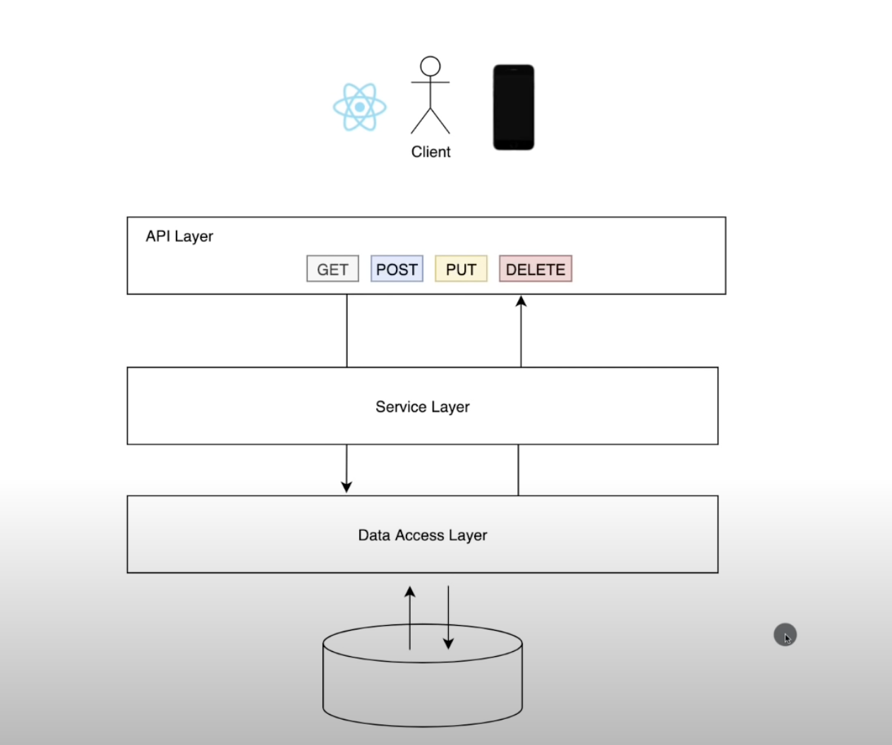
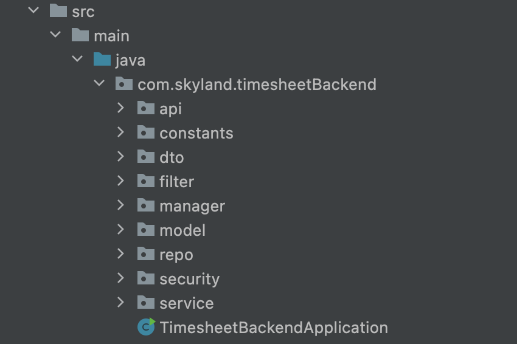
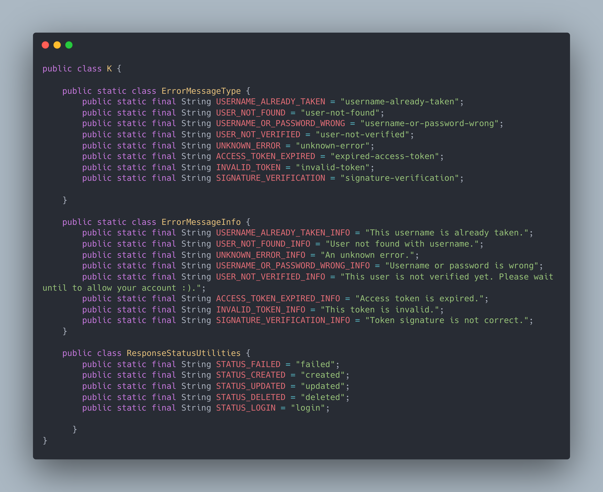

## About Project 

This backend project developed for Timesheet Project. SignIn/SignUp operations, JWT Token security .etc. 

## Architecture

This project has four layers.

- API LAYER: For client requests.

- SERVICE LAYER: Talks with API LAYER and DATA ACCESS LAYER.

- DATA ACCESS LAYER: This layer includes JpaRepositories. 

- DATABASE: Used MySQL database.

  

[image] 

## Folder Structure

api: For API LAYER.

constants: Includes project constants. 

dto: For DTO Classes.

filter: Contains two filter. AuthenticationFilter and AuthorizationFilter. AuthorizationFilter controls is token expired or invalid, AuthenticationFilter control Aiuthenticate informations are correct. 

manager: This part for ResponseModel management. This class is Singleton and provides Response Models to other files.

model: Model folder contains Role, Task and User Entities.

repo: Jpa Interfaces are in this folder.

security: Security Configuration is here.

service: For SERVICE LAYER.

## Built With

* Spring-Boot
* IntelliJ IDE

## API Document

Api document that explains that endpoints in this project, how to use them, respone types.

Document Link: https://skyland.atlassian.net/browse/SPTSU-26 (in comment)

